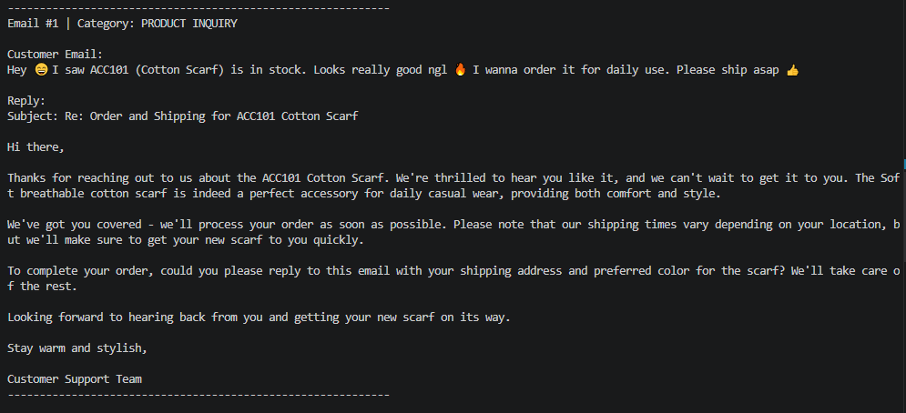
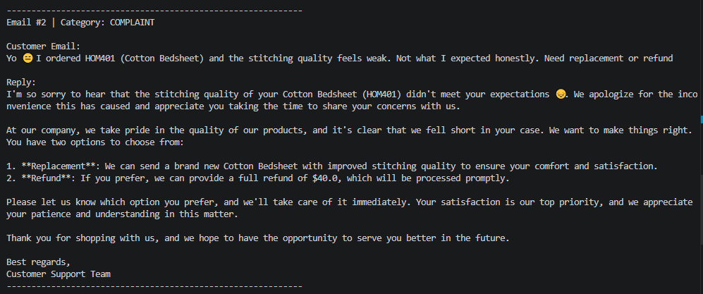

# LLM Email Auto Reply System


A Python project I built to automatically handle customer emails using AI. It reads an email, figures out what the customer is asking about, finds the relevant product, and writes back a proper reply — all without any human involvement.

---

## What it does

- Reads customer emails from a CSV file
- Classifies each email as a **product inquiry**, **complaint**, or **other**
- Extracts the **Product ID** if mentioned in the email
- Searches for the product using exact match or **semantic search (FAISS)**
- Generates a professional reply for each email type using **Google Gemini**

---

## Sample Output

**Product Inquiry**


**Complaint**


---

## Dataset

The project uses two CSV files.

| File | Description | Size |
|---|---|---|
| `products.csv` | Clothing product catalog with name, category, description, price and stock | ~25 products |
| `emails.csv` | Simulated customer emails covering inquiries and complaints | ~30 emails |

To run this project you can create your own CSV files with the same column structure or use any similar dataset.

**products.csv columns:**
`Product_ID`, `Product_Name`, `Category`, `Description`, `Price`, `Stock`

**emails.csv columns:**
`Email_Text`

---

## Tools and libraries used

| Library | Purpose |
|---|---|
| Google Gemini 2.0 Flash | Email classification and reply generation |
| FAISS | Finding the closest product when no ID is mentioned |
| Sentence Transformers | Converting text into vectors |
| Pandas | Reading CSV data |
| python-dotenv | Keeping the API key secure |

---

## How to run it

**1. Clone the repo**
```bash
git clone https://github.com/Aman132584/llm-email-auto-reply.git
cd llm-email-auto-reply
```

**2. Create and activate a virtual environment**
```bash
python -m venv venv
venv\Scripts\activate
```

**3. Install dependencies**
```bash
pip install -r requirements.txt
```
**4. Add your API key**

Create a `.env` file in the root folder and add:

Get a free key at [aistudio.google.com](https://aistudio.google.com/app/apikey)

**5. Add your data files**

Place your CSV files inside a `data/` folder:
- `data/products.csv`
- `data/emails.csv`

**6. Run**
```bash
python main.py
```

---
## Project Structure

```
📁 llm-email-auto-reply
│
├── 📄 main.py               # Main pipeline — holds the code
├── 📄 config.py             # Reads environment variables and file paths
├── 📄 requirements.txt      # All required libraries
├── 📄 .gitignore            # Files excluded
│
├── 📁 Outputs            # Sample output images
│   ├── output_1.PNG
│   ├── ouput_2.PNG
│   ├── output_3.PNG
│   └── ouput_4.PNG
│
└── 📁 data                  
    ├── products.csv         # Product catalog 
    └── emails.csv           # Customer emails 
```
---

## Note
An intelligent email automation system that classifies incoming customer emails and generates 
context-aware replies using LLMs. Designed to reduce manual effort in customer support workflows 
by automatically handling product inquiries and complaints.
